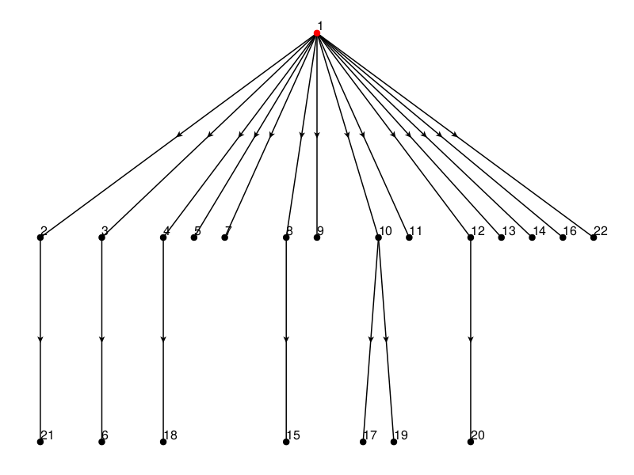

# JHistint.jl - Julia Histopathology Interface

Julia interface for implementing the REST APIs available on the Cancer Slide Digital Archive (CDSA) portal for downloading histological images available in The Cancer Genome Atlas (TCGA). The Cancer Slide Digital Archive (CDSA) is a web platform for support, sharing, and analysis of digital pathological data. Currently, it hosts over 23,000 images associated with the data available on "The Cancer Genome Atlas" Data Portal. The library includes functions for managing image-processing algorithms for cell segmentation, constructing the adjacency matrix, and interfacing with J-Space.jl package to simulate the spatial growth and the genomic evolution of a cell population and the experiment of sequencing the genome of the sampled cells.

CDSA Portal: [Click Here](https://api.digitalslidearchive.org/#collections)    

Repository containing the data mapped in the portal: [Click Here](https://cancer.digitalslidearchive.org/#!/CDSA/acc/TCGA-OR-A5J1)

Guide to using the APIs: [Click Here](https://api.digitalslidearchive.org/api/v1)

## Package Structure
* The `case` and `collection` folders store metadata in `.json` format for individual cases and collections available on the TCGA Data Portal. The `collection` folder is structured as follows:
  * `collectionlist.json` = Stores access data (metadata) for collections (Projects in TCGA).
  * `collection_name.json` = Stores access data (metadata) for a single collection. The `.json` file is generated based on the collection chosen by the user.
* The `case` folder is structured as follows:
  * `collection_name.json` = Stores all metadata related to cases associated with the collection selected by the user.
* The `slides` folder stores histological images related to individual cases. The images are organized based on collection (`TCGA-chol`, `TCGA-esca`, etc.), and the individual case being analyzed (`TCGA-2H-A9GF`, `TCGA-2H-A9GG`, etc.). Within each folder related to the case, the slides are stored in compressed `.zip` files. The format of each individual slide is `.tif`. The folder names related to the cases correspond to the values of the `Case ID` field listed in the TCGA Data Portal. The names of the `.zip` files located in each folder refer to the `Sample ID` attribute associated with the patient. The slide name is given by concatenating the `Slide ID` and `Slide UUID` attributes that can be found in the lower section of the web page dedicated to the generic case `TCGA-XX-YYYY`.

```
Example: TCGA-02-0001-01C-01-TS1.zip  
  - 02 = refers to the TSS (Tissue Source Site).  
  - 0001 = refers to the code associated with the Participant, an alphanumeric string.  
  - 01 = refers to the Sample Type. The values associated with tumor samples are in the range 01-09. 10-19 indicates the range for non-diseased normal samples. 20-29 indicates samples currently under control.  
  - C = refers to the Vial field related to the ordering of the sample in the sample sequence. Values range from A-Z.  
  - 01 = refers to the Portion field related to the ordering of the analyzed portions associated with a sample. It takes values in the range 01-99.  
  - TS1 = refers to the Slide field related to the type of image. The values that can be assumed are TS (Top Slide), BS (Bottom Slide), and MS (Middle Slide). The alphanumeric value indicates the slide ordering.
```

## JHistint Collections
The available collections are:
  * TCGA-BRCA = Breast Invasive Carcinoma (Breast)
  * TCGA-OV = Ovarian Serous Cystadenocarcinoma (Ovary)
  * TCGA-LUAD = Lung Adenocarcinoma (Bronchus and Lung)
  * TCGA-UCEC = Uterine Corpus Endometrial Carcinoma (Corpus uteri)
  * TCGA-GBM = Glioblastoma Multiforme (Brain)
  * TCGA-HSNC = Head and Neck Squamous Cell Carcinoma (Larynx, Lip, Tonsil, Gum, Other and unspecified parths of mouth)
  * TCGA-KIRC = Kidney Renal Clear Cell Carcinoma (Kidney)
  * TCGA-LGG = Brain Lower Grade Glioma (Brain)
  * TCGA-LUSC = Lung Squamous Cell Carcinoma (Bronchus and lung)
  * TCGA-TCHA = Thyroid Carcinoma (Thyroid gland)
  * TCGA-PRAD = Prostate Adenocarcinoma (Prostate gland)
  * TCGA-SKCM = Skin Cutaneous Melanoma (Skin)
  * TCGA-COAD = Colon Adenocarcinoma (Colon)
  * TCGA-STAD = Stomach Adenocarcinoma (Stomach)
  * TCGA-BLCA = Bladder Urothelial Carcinoma (Bladder)
  * TCGA-LIHC = Liver Hepatocellular Carcinoma (Liver and intrahepatic bile ducts)  
  * TCGA-CESC = Cervical Squamous Cell Carcinoma and Endocervical Adenocarcinoma (Cervix uteri)
  * TCGA-KIRP = Kidney Renal Papillary Cell Carcinoma (Kidney)
  * TCGA-SARC = Sarcoma (Various)
  * TCGA-ESCA = Esophageal Carcinoma (Esophagus)
  * TCGA-PAAD = Pancreatic Adenocarcinoma (Pancreas)
  * TCGA-READ = Rectum Adenocarcinoma (Rectum)
  * TCGA-PCPG = Pheochromocytoma and Paraganglioma (Adrenal gland)
  * TCGA-TGCT = Testicular Germ Cell Tumors (Testis)
  * TCGA-THYM = Thymoma (Thymus)
  * TCGA-ACC = Adrenocortical Carcinoma -Adenomas and Adenocarcinomas (Adrenal gland)
  * TCGA-MESO = Mesothelioma (Heart, mediastinum and pleura)
  * TCGA-UVM = Uveal Melanoma (Eye and adnexa)
  * TCGA-KICH = Kidney Chromophobe (Kidney)
  * TCGA-UCS = Uterine Carcinosarcoma (Uterus, NOS)
  * TCGA-CHOL = Cholangiocarcinoma (Liver and intrahepatic bile ducts, Other and unspecified part of biliary track)
  * TCGA-DLBC = Lymphoid Neoplasm Diffuse Large B-cell Lymphoma (Various)
To download a specific collection, just indicate the name of the collection: `BRCA`, `OV`, `LUAD`.

## APIs
Below are the APIs used in the project:
* The following URL is used to query the repository for the data collections for which histological slides are available in TCGA:  
https://api.digitalslidearchive.org/api/v1/folder?parentType=collection&parentId=$idTCGA&limit=0&sort=lowerName&sortdir=1  
The URL requires the definition of `parentType` and `parentId`. The `parentId` specifies the identifier of the collection. The image collection associated with TCGA is identified by the code: `5b9ef8e3e62914002e454c39`. The use of `limit=0` sets no limits on the queried file, ensuring the complete download of the file. The API belongs to the category for managing folders stored in the repository. The downloaded file is `.json`.  
* The following URL is used to query the repository and download the metadata associated with the chosen collection:  
https://api.digitalslidearchive.org/api/v1/folder?parentType=collection&parentId=5b9ef8e3e62914002e454c39&name=$collection_name&sort=lowerName&sortdir=1  
The URL requires the definition of `parentType`, `parentId`, and `name`. The `name` attribute identifies the name of the collection from which you want to retrieve data (e.g. `chol`, `esca`, etc.). The API belongs to the category for managing folders stored in the repository. The downloaded file is `.json`.  
* The following URL is used to query the repository and obtain information about individual cases:  
https://api.digitalslidearchive.org/api/v1/folder?parentType=folder&parentId=$project_id&limit=0&sort=lowerName&sortdir=1  
The URL requires the definition of `parentType` and `parentId`. Unlike the first API, the `parentType` attribute is set to `folder` due to the repository structure. The `parentId` is configured by defining the identifier of the chosen collection. The downloaded file is `.json`.  
* The following URL is used to query the repository and download the slide corresponding to the identifier:  
https://api.digitalslidearchive.org/api/v1/folder/$x/download  
The URL allows you to download a folder in `.zip` format. The download is based on the identifier of the folder.

## Package Installation (in progress)
The `JHistint` package is available in the Julia Registries and can be installed as follows:
```
julia > using Pkg
julia > Pkg.add("JHistint")
julia > using JHistint
```
Otherwise, type `]` in the Julia REPL and execute:
```
(@v1.8) pkg > add JHistint
(@v1.8) pkg > using JHistint
```

## Running DEMO
The input files used by the demo are available in the `input_example_demo` directory. The output files generated will also be saved in the related directory.  
If you want to access the demo output files directly without running it, they are available in the `output_example_demo` directory. Follow the steps below to start the demo: 
* Add `J-Space` package from `niccolo99mandelli` GitHub repository. Type `]` in Julia REPL and execute:
```
(@v1.8) pkg > add https://github.com/niccolo99mandelli/J-Space.jl.git
```
* Add `JHistint` package from `niccolo99mandelli` GitHub repository. Type `]` in Julia REPL and execute:
```
(@v1.8) pkg > add https://github.com/niccolo99mandelli/JHistint.jl.git
```
`Note : dependency error caused by unregistered package -> Need to be add to Julia Registries to resolve (in progress).`
* Activate `J-Space` package to avoid package dependency issues. From command-line type:
```
julia -e  'cd("/home/nmandelli/.julia/packages/J_Space/______/"); using Pkg; Pkg.activate("."); using J_Space;'
```
`Note : "______" refers to the code given to the installed package (J_Space), replace it with the code you can find in the indicated path. Make sure the path refers to the location of your package.`  
* Activate `JHistint` package and Run function for downloading slides and populating DB:  
```
julia -e  'cd("/home/nmandelli/.julia/packages/JHistint/______/"); using Pkg; Pkg.activate("."); using JHistint; JHistint.download_single_collection("lusc")'
```
`Note : "______" refers to the code given to the installed package (JHistint), replace it with the code you can find in the indicated path. Make sure the path refers to the location of your package.  
The demo is structured for three histological slides, therefore it is sufficient to interrupt the execution after downloading the first three slides (using Ctrl + C). The output will be displayed on the screen.` 
* Run function for segmentating slides in DB, creating graph and build adjancency matrix. Interface with `J-Space` for Files and Plots build:
```
julia -e  'using JHistint; JHistint.slide_cell_segmentation_without_download("lusc")'
```

### DEMO Results
Below is the output obtained from the DEMO execution:  
<p align="center">
    
</p>
All files generated by the simulator will be saved in the respective folders of each histological slide. Below are the results obtained from the segmentation of the three example slides:  
  
   
<table align="center">
    <tr>
      <td>
        
        <br>
        Example 1 - Histological Slide (.TIF)
      </td>
      <td>
        
        <br>
        Example 1 - Segmented Slide (.TIF)
      </td>
    </tr>
 </table>
 <table align="center">
    <tr>
      <td>
        
        <br>
        Example 2 - Histological Slide (.TIF)
      </td>
      <td>
        
        <br>
        Example 2 - Segmented Slide (.TIF)
      </td>
    </tr>
 </table>
 <table align="center">
    <tr>
      <td>
        
        <br>
        Example 3 - Histological Slide (.TIF)
      </td>
      <td>
        
        <br>
        Example 3 - Segmented Slide (.TIF)
      </td>
    </tr>
 </table>

 J-SPACE provides the following outputs:  
  - The state of the lattice at any time of the simulation (as plot in `filename_Plots_JSpace`).
  - The Ground Truth (GT) genotype of the sampled cells as FASTA files (in `filename_Files_JSpace`).
  - The GT phylogenetic  tree  of the sampled cells in Newick format (in `filename_Files_JSpace`).
  - The plot of the mutational tree of the driver mutations (if present in `filename_Plots_JSpace`).
  - The list of the driver mutation with their birth rate advantage as .csv (if present in `filename_Files_JSpace`).
  - The simulated next-generation sequencing reads as FASTQ files in the folder "/"path_to_save_files"/Fasta output/sample_#", where sample_# is the #-th sample (in `filename_Files_JSpace/Fasta output`).
  - The alignment file, which maps the noisy reads on the sequences of the sampled cells both in formats SAM and ALN (in `filename_Files_JSpace`).
  - The alignment file, without noise in format SAM (in `filename_Files_JSpace`).
  - The list of the mutations for each sample as csv (in `filename_Files_JSpace`).

The state of the lattice at any time of the simulation for the three different examples are provided below:  
 <table align="center">
    <tr>
      <td>
        
        <br>
        Example 1 - State of the lattice at t = 10
      </td>
 </tr>
 <tr>
      <td>
        
        <br>
        Example 1 - State of the lattice at t = 20
      </td>
  </tr>  
  <tr>
      <td>
        
        <br>
        Example 1 - State of the lattice at final t
      </td>
    </tr>
 </table>

<table align="center">
    <tr>
      <td>
        
        <br>
        Example 2 - State of the lattice at t = 10
      </td>
 </tr>
 <tr>
      <td>
        
        <br>
        Example 2 - State of the lattice at t = 20
      </td>
  </tr>  
  <tr>
      <td>
        
        <br>
        Example 2 - State of the lattice at final t
      </td>
    </tr>
 </table>
 
 <table align="center">
    <tr>
      <td>
        
        <br>
        Example 3 - State of the lattice at t = 10
      </td>
 </tr>
 <tr>
      <td>
        
        <br>
        Example 3 - State of the lattice at t = 20
      </td>
  </tr>  
  <tr>
      <td>
        
        <br>
        Example 3 - State of the lattice at final t
      </td>
    </tr>
 </table>
 
 The comparisons of the driver_tree for the three different examples are provided below:
  <table align="center">
    <tr>
      <td>
        
        <br>
        Example 1 - Driver Tree
      </td>
      <td>
        
        <br>
        Example 2 - Driver Tree
      </td>
      <td>
        
        <br>
        Example 3 - Driver Tree
      </td>
    </tr>
 </table>

## Documentation
Documentation is available on the Julia Pages at:  https://niccolo99mandelli.github.io/JHistint.jl/  
Further information about the J-Space package can be found at the following repository: https://github.com/niccolo99mandelli/J-Space.jl.git

